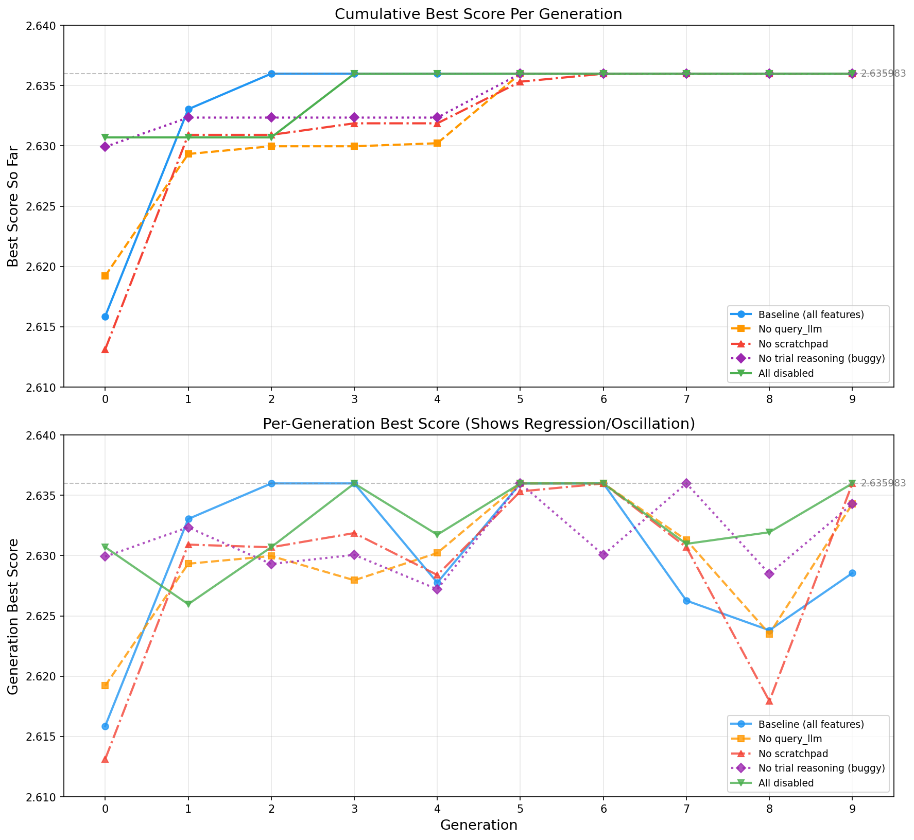
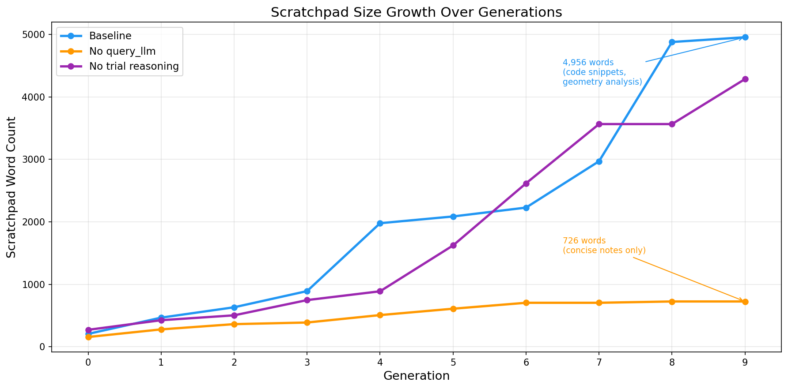

# MangoEvolve: Beating State-of-the-Art Evolutionary Code Generation with a Single Cheap Model

## Introduction

In October, Alex Zhang created a [blog post about RLMs](TODO_INSERT_LINK). I highly recommend reading the paper as it's a pretty fast read and gives two useful insights in how one could deal with long context: putting the prompt into the LLM's environment and having an LLM call other LLMs. At the time I was also working on a line of work related to OpenEvolve / ShinkaEvolve, and well, it seemed like these two things could fit together pretty well. But first, let's get into what these do.

## What is AlphaEvolve?

[AlphaEvolve](TODO_CITE_PAPER) is a paper released by Google. The core intuition behind it is to take the ideas of LLMs and genetic algorithms and mash them together. The TL;DR of the paper is that if you query an LLM a bunch of times, choose some samples of said query, and then feed them back into the LLM to iterate and repeat this process a bunch of times, it's pretty good at pushing the bounds on verifiable and scorable problems. Think problems like how many circles can fit into a unit square, how to more efficiently multiply two matrices, optimizing arithmetic circuits, and it managed to write an attention kernel which improved Gemini training time by 1%. There have also been a bunch of offshoots either in the realm of startups, research ([link to Anne's thing](TODO)), or other improvements ([ShinkaEvolve](https://arxiv.org/html/2509.19349v1)). Hopefully, this convinces you this thing ends up being useful.

However, how does AlphaEvolve work more deeply under the hood? Specifically, we care about how it chooses which samples to iterate on. As the paper is closed source, we will instead refer to the implementation known as [OpenEvolve](https://github.com/algorithmicsuperintelligence/openevolve) since we can peek at the code.

The architecture involves a **controller**, **LLM samplers**, and an **environment to evaluate**. The controller is responsible for creating a database of the samples. The database is composed by taking samples and distributing them into islands (this is done arbitrarily). Then each island has a grid which scores the solutions' performance and diversity, as well as some logic which moves things between islands. Based on these performance and diversity scores, the controller chooses which samples to iterate on.

This may seem complicated, but in practice is quite simple and is a great intuition for solving a bunch of problems.

## What is RLM?

Recursive Language Models is some research that was released in October and more fleshed out in a paper at the end of last year ([insert paper link](TODO)). Specifically, the paper deals with issues with long context. We've all dealt with it. There are problems in which we'd like to stick a bunch of information into an LLM but it's either too much or there is a failure case at long context. A canonical example is a really fat codebase.

The proposed solution is to introduce all of this context / super long prompt as a variable in a Python REPL and add the ability in that REPL to call other LLMs (i.e., add an `llm_query` function). Then we give a root LM the REPL and say "go answer the question in `x`." This works quite well as the LM can peek at the prompt / context and figure out how to dissect and deal with the problem as appropriate. This simple, bitter-lesson-pilled methodology managed to do really well in long context tasks. I imagine this will have a large impact on post-training and industry -- sort of like how top-p is used in sampling but nobody thinks about it.

## How Do These Concepts Fit Together?

So I gave you this TL;DR about sampling which is sort of correct, but notice a lot of the conceptual complexity is in how we do the sampling. Part of the reason we do this sampling is that we can't just stick everything into the LLM -- as the number of samples explodes, the context blows up way over the max size. Therefore, instead of a database, we can have the LLM explore solutions by itself using an RLM-ish approach, and have it select which samples to evolve in the database.

## Architecture

Relative to AlphaEvolve, MangoEvolve uses **REPL-Based Evolution**. We also allow a single root LLM and multiple possible child LLMs (i.e., the root LLM can invoke Opus, GPT, Gemini, etc. in the same run). The way it works is as follows:

1. We do a **calibration phase** where the root LLM is allowed to query the various child LLMs questions to figure out their capabilities. This produces a note that is attached to the scratchpad during evolution. The scratchpad here is a bit of text that the root LLM produces that is attached to its prompt in future evolutions.

2. The Root LLM is asked to produce an output with ` ```python ``` ` blocks that call `spawn_children()` with bespoke prompts. Prompts can include `{{CODE_TRIAL_X_Y}}` tokens to reference prior code, which are post-processed to corresponding code from past trials (this is to reduce costs, but in practice you don't need the tokens).

3. Child LLMs receive a minimal, task-focused system prompt; their responses are parsed for code, evaluated, and logged.

4. The Root LLM is fed a **compact generation summary** (scores, errors, code refs, lineage + scratchpad), plus an explicit selection request. This is done by emitting a trial variable which it can interact with in order to prep prompts for its next `spawn_children()` call. This feedback is the main refinement signal for the next prompt round.

5. We repeat this process a preset number of times.

```
Root LLM (REPL) --> spawn_children() --> Child LLM --> Code
      |                                               |
      |                                               v
      |                                        evaluate_program()
      |                                               |
      <----------- metrics, reasoning <---------------+
      |
      v
advance_generation() / terminate_evolution()
```

The key features that differentiate MangoEvolve from OpenEvolve and similar systems:

- **Scratchpad**: A persistent text buffer that the root LLM writes to and reads from across generations. It serves as working memory -- the root LLM can record strategies, code snippets, analysis notes, and error patterns.
- **query_llm**: The ability for the root LLM to invoke child LLMs for analytical tasks (not just code generation). For example, the root LLM can ask a child to "compare trial_2_4 and trial_1_2 -- why does 2_4 score higher?" and use the response to inform its next generation of prompts.
- **REPL Environment**: The root LLM operates in a Python REPL where it can define helper functions, manipulate trial data, and build analytical tools that persist across generations.

## Results

### Performance Summary

The target benchmark is **circle packing**: pack 26 non-overlapping circles into a unit square to maximize the sum of their radii. This is a standard benchmark for evolutionary code generation, used by AlphaEvolve, ShinkaEvolve, and OpenEvolve.

The best known score for N=26 is approximately **2.635985** (AlphaEvolve). ShinkaEvolve reports **2.635983** with relaxed tolerances and **2.63598** strict. OpenEvolve's community best is **2.635977**.

#### Published State-of-the-Art Results

| System | Score (Relaxed) | Score (Strict) | Models | Evaluations | Cost |
|--------|----------------|----------------|--------|-------------|------|
| Previous best known | 2.6340 | 2.6340 | N/A | N/A | N/A |
| AlphaEvolve (Google) | 2.63586275 | N/A | Gemini (internal) | Thousands | N/A |
| ShinkaEvolve (Sakana AI) | 2.635983099 | 2.63597771 | Claude Sonnet 4, o4-mini, GPT-4.1{,mini,nano} | 150 | N/A |
| OpenEvolve (community) | 2.635977395 | N/A | Gemini Flash 2.0 + Claude 3.7 Sonnet | ~460 gens | N/A |

#### MangoEvolve Results

| Configuration | Score (Relaxed) | Score (Strict) | Models | Trials | Gens | Cost |
|--------------|----------------|----------------|--------|--------|------|------|
| **Gemini 3 Flash** (all features) | 2.6359830849 | 2.6359830274 | gemini-3-flash | 60 | 10 | **$0.70** |
| **OpenEvolve config** | 2.6359830849 | 2.6359828249 | Claude 3.7 Sonnet + Gemini 2.0 Flash | 160 | 16 | $10.16 |

The **Gemini 3 Flash** configuration achieves the same final score as all other configurations for **$0.70** using a single cheap model. The **OpenEvolve config** uses the exact same models as OpenEvolve (Claude 3.7 Sonnet root + Gemini 2.0 Flash children) -- MangoEvolve reaches the same score plateau in 160 trials vs OpenEvolve's ~460 generations.

A note on **ShinkaEvolve**: their system uses 5 frontier models (Claude Sonnet 4, o4-mini, GPT-4.1, GPT-4.1-mini, GPT-4.1-nano) and reports 150 "evaluations." However, their definition of evaluation differs from ours -- ShinkaEvolve rejects many LLM outputs before they reach evaluation (outputs that fail parsing, validation, etc.). Our "trial" count includes every child LLM call that produces code, whether valid or not. This makes direct evaluation-count comparison difficult, but the key point is that MangoEvolve matches their score with a single $0.01/call model.

### The Tolerance Question

Circle packing scores in evolutionary code generation are more nuanced than they first appear. The evaluator uses a **tolerance of 1e-6** that relaxes constraints in two ways:

1. **Boundary**: Circles may extend up to 1e-6 beyond the [0,1] square
2. **Overlap**: Required separation distance reduced by 1e-6 (i.e., `dist >= r_i + r_j - 1e-6`)

This means a "score" of 2.635983 may not correspond to a strictly feasible packing. ShinkaEvolve's paper is admirably transparent about this, explicitly reporting both: **2.635983099** (relaxed) vs **2.63597771** (strict) -- a difference of ~5.4e-6.

For MangoEvolve, we computed strict scores two ways:
1. **Re-execution**: Run the best trial's code again, then uniformly shrink all radii until every constraint holds at tolerance=0 (the "alpha method")
2. **Analytical bound**: Shrink each radius by 1e-8: `strict_score = recorded_score - 26 * 1e-8`

We report the best of the two because the algorithms are stochastic -- re-execution may land on a different local optimum.

| Experiment | Relaxed Score | Strict Score | Delta |
|-----------|--------------|-------------|-------|
| Baseline (all features) | 2.6359830849 | 2.6359830274 | 5.75e-08 |
| No query_llm | 2.6359830855 | 2.6359828255 | 2.60e-07 |
| No scratchpad | 2.6359830850 | 2.6359829142 | 1.71e-07 |
| All disabled | 2.6359830849 | 2.6359828249 | 2.60e-07 |
| OpenEvolve config | 2.6359830849 | 2.6359828249 | 2.60e-07 |

The worst-case relaxed-to-strict delta is **2.6e-7** -- that's **20x smaller** than ShinkaEvolve's reported gap of ~5.4e-6. Several experiments are already strictly valid upon re-execution (alpha=1.0). This is because the generated SLSQP algorithms use internal tolerances of ftol=1e-12, producing near-strict solutions even under relaxed evaluation.

The key takeaway: above the ~2.635983 threshold, things get fuzzy. ShinkaEvolve saw a massive hit when switching to strict evaluation (2.635983 -> 2.635978). MangoEvolve's solutions are numerically tighter, but the differences at this precision level are within the noise of SLSQP convergence.

### Convergence: 18 Trials to State-of-the-Art

Perhaps the most striking result is convergence speed. The baseline configuration reaches the 2.635983 plateau at **Generation 2 -- just 18 trials** (6 children per generation).

| Experiment | Gen to >= 2.635983 | Total Trials | Cost to Reach |
|-----------|-------------------|-------------|---------------|
| **Baseline** | **Gen 2** | **18** | ~$0.14 |
| All disabled | Gen 5 | 36 | ~$0.30 |
| No query_llm | Gen 5 | 36 | ~$0.36 |
| No scratchpad | Gen 9 | 60 | ~$0.62 |

For comparison: ShinkaEvolve uses 150 evaluations across 5 frontier models. OpenEvolve uses ~460 generations. MangoEvolve's baseline reaches the same score in 18 trials of a single cheap model.

## Ablations

We ran 5 ablation configurations to understand which features of MangoEvolve actually matter:

| Ablation | Features Enabled | Best Score | Gen to 2.635983 | Cost |
|----------|-----------------|-----------|-----------------|------|
| **Baseline** | scratchpad + query_llm | 2.6359830849 | Gen 2 (18 trials) | $0.70 |
| **No query_llm** | scratchpad only | 2.6359830855 | Gen 5 (36 trials) | $0.71 |
| **No scratchpad** | query_llm only | 2.6359830850 | Gen 9 (60 trials) | $0.62 |
| **No trial reasoning** | scratchpad + query_llm (buggy*) | 2.6359830849 | Gen 5 (36 trials) | $0.69 |
| **All disabled** | none | 2.6359830849 | Gen 5 (36 trials) | $0.59 |

*The no_trial_reasoning ablation has a bug where trial reasoning was never actually exposed to the root LLM in any configuration. This ablation effectively serves as a second baseline run with different random seeds.

The punchline: **every configuration reaches the same final score**. The features affect convergence speed, not the reachable optimum. The cheapest configuration ("all disabled" at $0.59) matches the most expensive ($0.70 baseline).

### Convergence Behavior

The convergence graph below shows cumulative best score per generation for each ablation:



Key observations from the convergence curves:

1. **Baseline converges fastest** (Gen 2), likely aided by the combination of scratchpad strategy accumulation and query_llm-assisted code analysis
2. **All disabled converges at Gen 5** -- the same speed as no_query_llm, suggesting that when both features are absent, the core evolutionary loop is sufficient
3. **No scratchpad shows oscillation**: The bottom panel of the chart shows per-generation best scores, and the no_scratchpad experiment exhibits a distinctive oscillation pattern. It reaches 2.6360 at Gen 6, drops to 2.6179 at Gen 8, then recovers at Gen 9. This is the "memory loss" pattern -- without persistent notes, the root LLM repeatedly discovers then forgets the winning approach.
4. **All experiments plateau identically** once they find the optimum. The optimization landscape funnels to the same local/global optimum regardless of features.

### How query_llm Was Used

The `query_llm` function allows the root LLM to invoke child LLMs for analytical purposes -- not to generate trial code, but to reason about existing trials. Across the three experiments with query_llm enabled, here's how it was used:

#### query_llm Call Counts by Category

| Category | Baseline | No Scratchpad | No Trial Reasoning | Description |
|----------|----------|---------------|-------------------|-------------|
| **comparison** | 6 | 11 | 8 | Comparing two or more trials' code and strategies |
| **trial_analysis** | 4 | 9 | 6 | Analyzing a single trial's code, score, or approach |
| **batch_analysis** | 6 | 0 | 3 | Batch queries via a pre-built `analysis_queries` list |
| **error_diagnosis** | 2 | 1 | 1 | Diagnosing why trials failed (INVALID) |
| **Total** | **18** | **21** | **18** |

#### Per-Experiment Analysis

**Baseline (18 calls)**: The baseline used query_llm in a structured, evolving way. In early generations (Gen 0-2), calls focused on error diagnosis ("Analyze why these trials failed") and identifying winning strategies ("Why is trial_1_2 scoring higher?"). After the Gen 2 breakthrough, calls shifted to precision-focused comparisons ("Compare trial_2_4 with trial_3_4 -- did micro-jitter work?") and ultimately to mathematical analysis ("Analyze the center coordinates" and "How to squeeze out another 2e-6 in precision"). The 6 "batch_analysis" calls used a pre-built `analysis_queries` variable -- the root LLM composed lists of structured queries and submitted them together, showing sophisticated tool use. Notably, query_llm feedback was recorded in the scratchpad, creating a positive feedback loop: query_llm analysis -> scratchpad notes -> better prompts -> better trials.

**No Scratchpad (21 calls -- highest count)**: Without persistent memory, the no_scratchpad experiment made the most query_llm calls. The pattern is revealing: **11 comparison calls** (vs 6 for baseline) and **9 trial_analysis calls** (vs 4 for baseline). The root LLM was using query_llm as a substitute for scratchpad -- re-analyzing trials it had already analyzed in previous generations because it couldn't remember the conclusions. This is the clearest evidence that query_llm and scratchpad are partially fungible. Uniquely, this experiment included **code_review** calls ("Extract and explain the LP refinement and penalty continuation logic") -- the root LLM asked query_llm to serve as an external code comprehension tool, something the baseline never needed because it could record code analysis in the scratchpad.

**No Trial Reasoning (18 calls)**: Similar pattern to baseline with slightly more comparison calls (8 vs 6). Since this is effectively a second baseline run, the minor differences are likely due to different random seeds leading to different trial outcomes that prompted different analytical questions.

#### Impact Assessment

Does query_llm improve final scores? **No.** All configurations reach the same score. Does it improve convergence speed? **Modestly.** The baseline (with query_llm + scratchpad) reaches the optimum at Gen 2 vs Gen 5 for no_query_llm, but the all_disabled configuration (no query_llm, no scratchpad) also reaches Gen 5. The 3-generation speedup from query_llm exists but is inseparable from the synergy with scratchpad.

The main value of query_llm is **qualitative**: it produces richer scratchpad content (4,956 words vs 726 without it), deeper error analysis, and more informed strategy evolution. For a human reader trying to understand *why* the system converged, query_llm-generated analysis is invaluable. For the final score, it's unnecessary.

### Scratchpad: The Memory That Matters

The scratchpad is a persistent text buffer that the root LLM reads and writes across generations. It's the closest thing MangoEvolve has to long-term memory.



#### Growth Patterns

| Experiment | Gen 0 Words | Gen 9 Words | Growth Factor | Has Code Snippets |
|-----------|------------|------------|---------------|-------------------|
| Baseline | 207 | 4,956 | 24x | Yes (from Gen 4) |
| No query_llm | 157 | 726 | 4.6x | No |
| No trial reasoning | 272 | 4,287 | 16x | Yes (from Gen 5) |

The baseline scratchpad grew **24x** over 10 generations -- from a brief strategy outline to a 4,956-word research notebook containing mathematical analysis, code snippets, geometry analysis, and precision limit discussions. By contrast, the no_query_llm scratchpad grew only **4.6x** to 726 words -- concise bullet points without the detailed analytical passages that query_llm feedback enables.

#### What Goes Into the Scratchpad

**Baseline scratchpad evolution**:
- **Gen 0** (207 words): Initial strategy with 6 approaches to explore, key constraints listed, first generation analysis
- **Gen 2** (expanded): **"HUGE SUCCESS: trial_2_4 achieved 2.635983"** -- the root LLM immediately recognized the breakthrough. Recorded the winning "shaking + SLSQP" pattern with specific details about why it worked (squared distance constraints, vectorized Jacobian, polishing step)
- **Gen 4** (~1,979 words): Added code snippets for LP-based radii optimization. The scratchpad began containing executable code, not just prose notes
- **Gen 9** (4,956 words): A full research notebook including:
  - Mathematical analysis of packing structure (contact graph analysis, which circles touch which)
  - Precision limit discussion (why scores can't exceed 2.635985)
  - Detailed comparison of trial_6_4 vs trial_8_3 optimization strategies
  - LP integration code for guaranteed-optimal radii given fixed centers
  - Error pattern tracking across generations

**No query_llm scratchpad** (726 words at Gen 9): Same themes but drastically thinner. The scratchpad even **stalls entirely** in later generations -- Gen 7 is identical to Gen 6, Gen 9 is identical to Gen 8, with no new content added. It lacks:
- Code snippets (none at all -- baseline produces ~110-line code snippets from Gen 4)
- Detailed error analysis or failure post-mortems
- Multi-paragraph analytical passages
- Mathematical reasoning about the packing structure
- Geometry analysis (baseline's Gen 7 contains a sophisticated structural analysis: "This trial represents a highly perturbed 5x5 grid that has 'buckled' into a staggered, semi-irregular arrangement")

Despite being 6.8x shorter, the no_query_llm scratchpad tells a *cleaner* narrative: grid -> hexagonal -> force-directed -> force-directed+annealing -> breakthrough. Without verbose query_llm analysis, the evolution path is easier to follow.

**No trial reasoning scratchpad** (4,287 words at Gen 9): Similar depth to baseline (15.8x growth) with some uniquely insightful frames:
- *"Over-Engineering" diagnosis*: "Gen 6 trials suffered from 'Over-Engineering.' By adding complex dependencies like LP solvers or generic global optimizers, they lost the ability to perform the high-frequency iterations that 5_0 performs."
- *Topology-preservation principle*: "At a score of 2.635983, the 'layout' is almost certainly correct. Replacing circles is too disruptive."
- *LP vs SLSQP trade-off*: "LP solvers can sometimes push radii to zero for 'crowded' circles to favor others, whereas SLSQP tends to keep all circles 'in the game'"

The key difference: with query_llm, the scratchpad becomes a knowledge base that compounds over generations. Without it, the scratchpad is just a log. Interestingly, no_trial_reasoning produces some uniquely insightful higher-level lessons -- perhaps because without detailed trial analysis, the root LLM is forced to synthesize principles rather than focus on specifics.

#### Impact Assessment

The no_scratchpad experiment demonstrates the scratchpad's value dramatically. It is the **slowest ablation to converge** (Gen 9, 60 trials) and the **only one to exhibit the "memory loss" oscillation** pattern (reaching 2.636 at Gen 6, dropping to 2.618 at Gen 8, recovering at Gen 9). This oscillation is unique to no_scratchpad -- without persistent notes, the root LLM literally "forgot" the winning algorithm and had to rediscover it.

Removing scratchpad causes a **7-generation delay** vs baseline (Gen 2 -> Gen 9). By comparison, removing query_llm only causes a 3-generation delay (Gen 2 -> Gen 5). Removing both causes a 3-generation delay (Gen 2 -> Gen 5). This reveals an interaction effect: with query_llm available but no scratchpad, the root LLM may over-rely on query_llm analysis that it can't persist, leading to more erratic behavior than having neither feature.

### REPL Usage: Building Domain-Specific Tools

The root LLM operates in a Python REPL and can define helper functions that persist within the session. Different ablations showed markedly different REPL usage patterns:

| Experiment | Unique Functions | Persisting | Notable Functions |
|-----------|-----------------|------------|-------------------|
| **Baseline** | 4 | 1 (`get_top_trials`, 6 gens) | `check_precision_limit()`, `analyze_best_geometry()`, `analyze_trial()` |
| **No query_llm** | 6 (most) | 1 (`get_best_config`) | `analyze_gen3()`, `analyze_generation_4()`, `check_validity()` |
| **No scratchpad** | 2 | 0 | `log_progress()`, `summarize_trials()` |
| **No trial reasoning** | 6 | 2 | `generate_prompts()`, `compute_score_stats()`, `analyze_best_trials()` |
| **All disabled** | 1 (fewest) | 0 | `get_best_score(trials)` |

Key observations:

1. **All disabled defined only 1 function** -- demonstrating that the core evolutionary loop can function with almost no REPL infrastructure. The root LLM in minimal mode simply examines trial results and generates prompts, without building analytical tools.

2. **No query_llm built the most compensatory analysis tools (6 functions)**: Without `query_llm()` to delegate analysis, the root LLM built its own analysis functions (`analyze_gen3()`, `analyze_generation_4()`, `check_validity()`). These served as partial substitutes -- the root LLM analyzed trials locally rather than delegating to an external LLM. The `check_validity(centers, radii)` function at Gen 6 is particularly interesting: it implements custom constraint checking with 1e-10 tolerance, showing the root LLM building domain-specific validation tools.

3. **No scratchpad had the fewest functional functions (2)**, both simple loggers defined at Gen 0 that never persisted. Without persistent memory to build on, the root LLM didn't invest in REPL tooling -- there was nothing to accumulate. This contrasts sharply with no_query_llm, which compensated for its missing feature by building more REPL tools.

4. **Baseline defined the most sophisticated single functions**: `check_precision_limit()` (Gen 6, testing numerical boundaries), `analyze_best_geometry()` (Gen 7, packing structure analysis via query_llm), and `analyze_trial()` (Gen 7, geometric metric extraction). These reflect a root LLM that builds domain knowledge incrementally, aided by query_llm insights recorded in the scratchpad.

5. **Analysis functions dominate**: 7 of 16 unique functions across all experiments are analysis/inspection tools. The root LLM overwhelmingly uses REPL functions for understanding results rather than control flow. Prompt construction functions (`create_prompts`, `generate_prompts`) are always one-shot -- defined in a single generation and never reused.

6. **Validation functions appear at the midpoint**: Both `check_precision_limit` (baseline, Gen 6) and `check_validity` (no_query_llm, Gen 6) appear at Generation 6. Around the midpoint of evolution, the root LLM starts investigating *why* scores plateau and builds diagnostic tools to understand constraints.

### The Universal Algorithm: Shaking + SLSQP

Across all 5 ablation experiments, every configuration independently discovered the same winning algorithm pattern:

1. **Initialize** with a grid or force-directed layout
2. **Apply random perturbations** ("shaking") -- remove small circles, re-place them in gaps
3. **Run SLSQP** local optimization with analytical Jacobians
4. **Keep the best** result and repeat

| Ablation | Discovery Trial | Discovery Gen |
|----------|----------------|---------------|
| Baseline | trial_2_4 | Gen 2 |
| No query_llm | trial_5_4 | Gen 5 |
| No scratchpad | trial_9_2 | Gen 9 |
| No trial reasoning | trial_5_0 | Gen 5 |
| All disabled | trial_5_0 | Gen 5 |

The exact generation varies, but the algorithm is always the same. This convergence universality is perhaps the most important finding: **the evolutionary pressure reliably discovers the same algorithmic approach regardless of the root LLM's available tools.** The features affect how fast the root LLM guides the search there, not whether it gets there.

All experiments converge to approximately **2.63598308xx** -- the variation in the last 2-3 digits is within SLSQP numerical precision limits, confirming all experiments find the same packing configuration.

## Emergent Behaviors

Beyond the ablation experiments, earlier MangoEvolve runs (December 2025, using Claude Opus with extended thinking) revealed several emergent behaviors where the root LLM acted as a sophisticated orchestrator rather than a simple prompt relay:

### The Root LLM as Controller

The root LLM acts as a strict orchestrator, not just a recommender. It asserts constraints, prioritizes execution efficiency, and actively suppresses risky or slow approaches:

- **Hard limits on iterations and timeouts**: The root LLM explicitly instructs child LLMs: *"CRITICAL: Do NOT increase niter above 30 (times out)"* -- demonstrating learned awareness of the 300-second evaluation limit after observing earlier timeout failures. It doesn't just suggest caution, it issues hard constraints in ALL-CAPS.

- **Model role management**: After observing that Opus produced formatting errors ("4 'No Python code block' errors from Opus"), the root LLM autonomously wrote a model usage guide in its scratchpad:

  > **Model Usage Guide:**
  > - gemini-flash: Code generation, quick iterations
  > - sonnet: Code + reasoning, creative variations
  > - opus: AVOID for code (formatting issues), maybe for analysis only

  This is remarkable -- the root LLM developed its own model selection policy based on observed failure modes, without being instructed to manage model allocation.

- **Selection reasoning**: The root LLM provides explicit selection reasoning that balances exploitation and exploration. For example, after Generation 0 of the multi-model run, it selected 4 trials with distinct rationales: trial_0_12 for "performance" (best score), trial_0_13 for "performance" (second best), trial_0_6 for "diversity" (different initialization approach), and trial_0_9 for "diversity" (gradient-based approach). This shows sophisticated portfolio management rather than purely greedy selection.

### Meta-Reasoning About the Evolutionary Process

Perhaps the most striking emergent behavior was the root LLM *diagnosing a flaw in the evolutionary process itself*. After two generations failed to improve on its best score (2.6343), the root LLM wrote:

> **CRITICAL PROBLEM IDENTIFIED:**
> Children are NOT inheriting trial_3_0's actual configuration!
> - When {{CODE_TRIAL_3_0}} runs, it uses random seeds
> - Each child gets a DIFFERENT random configuration
> - We're NOT actually mutating the 2.6343 solution!

The root LLM correctly identified that because child code includes `np.random.seed(42)`, the code is deterministic -- but children who modify the code may change the seed, meaning they're not actually starting from the same configuration. It then took corrective action, sending one child the exact unmodified code with instructions: *"EXACT COPY: Just run this code without any modifications... Do NOT modify anything."*

This is meta-evolutionary reasoning -- the root LLM isn't just optimizing the problem, it's debugging the optimization process itself.

### Autonomous Tool Building

In the ablation experiments, the root LLM spontaneously built domain-specific tools without being instructed to:

- **LP radii optimizer**: The baseline root LLM defined `get_optimal_radii(centers)` which uses linear programming to compute mathematically optimal radii for any given set of circle centers. This is a non-trivial mathematical insight -- for fixed centers, the sum-of-radii objective with non-overlap and boundary constraints forms a linear program. The root LLM discovered this and implemented it as a reusable REPL function.

- **Precision limit checker**: At Gen 6, the baseline root LLM defined `check_precision_limit()` to test whether the 2.635983 score represents a fundamental numerical boundary or whether further improvement is possible. This meta-analytical behavior -- questioning the limits of the optimization itself -- was entirely self-directed.

- **Geometry analyzer**: At Gen 7, the baseline root LLM defined `analyze_best_geometry()` which uses `query_llm` to analyze the top 3 trials' center coordinates for geometric patterns (grid vs. irregular packing). This shows the root LLM developing domain understanding -- combining REPL functions with query_llm to investigate the mathematical structure of high-scoring solutions.

### Strategy Sophistication Over Generations

The baseline scratchpad reveals a trajectory from naive exploration to sophisticated mathematical reasoning:

- **Gen 0**: "Multi-start SLSQP with random initializations" -- standard optimization textbook approach
- **Gen 2**: "The 'shaking' strategy (local perturbations + SLSQP refinement) is clearly the winning metaheuristic" -- algorithmic insight
- **Gen 4-6**: Code snippets for LP integration, Jacobian computation, contact-preserving moves -- implementation-level detail
- **Gen 8-9**: "The gap to the best known (2.635985) is only 0.000002... analyzing whether this represents a precision limit" -- meta-reasoning about the problem's fundamental limits

This progression from textbook strategies to mathematical analysis to meta-reasoning about precision limits happened autonomously over 10 generations, driven entirely by the evolutionary feedback loop.

## Key Takeaways

1. **A single cheap model matches state-of-the-art**: MangoEvolve with gemini-3-flash ($0.70) achieves the same circle packing score as ShinkaEvolve (5 frontier models) and OpenEvolve (Claude 3.7 + Gemini Flash). The REPL-based architecture extracts more value from fewer, cheaper LLM calls.

2. **18 trials is enough**: The baseline reaches the optimum in 18 trials (Gen 2). Even the worst ablation needs only 60. This is dramatically more sample-efficient than prior work.

3. **Features help convergence, not final performance**: Scratchpad and query_llm accelerate convergence (Gen 2 vs Gen 5-9) but don't change the reachable score. The cheapest configuration ($0.59, no features) matches the most expensive.

4. **Scratchpad is the most valuable feature**: A 7-generation convergence improvement (Gen 2 vs Gen 9), and the only feature whose absence causes oscillating "memory loss" behavior.

5. **The algorithm always converges**: Every configuration independently discovers "shaking + SLSQP" -- the evolutionary pressure reliably finds the same algorithmic approach regardless of available tools.

6. **Multi-model diversity doesn't help (for this problem)**: The OpenEvolve config (2 models, $10.16) reaches the same score as single-model ($0.70). Cost scales linearly with model count but performance doesn't.
